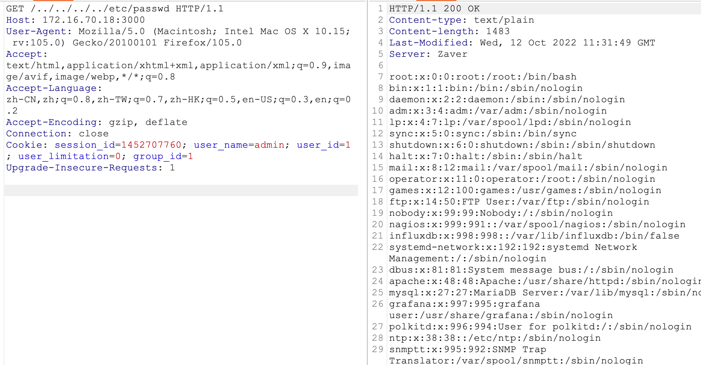

Zaver
=====

Yet another fast and efficient HTTP server.

## purpose

The purpose of Zaver is to help developers understand how to write a high performance server based on epoll. Although Nginx is a good learning example, its complexity and huge code base make people discouraged. Zaver uses as few codes as possible to demonstrate the core structure of high performance server like Nginx. Developers can lay a solid foundation by learning Zaver for further study in network programming.

## programming model

* epoll
* non-blocking I/O
* thread-pool

## compile and run (for now only support Linux2.6+)

please make sure you have [cmake](https://cmake.org/) installed.
```
mkdir build && cd build
cmake .. && make
cd .. && ./build/zaver -c zaver.conf
```

## support

* HTTP persistent connection
* browser cache
* timer(use binary heap instead of rbtree used in Nginx)

## todo

* sendfile
* proxy
* FastCGI
* other HTTP/1.1 features
* memory pool
* WebDAV?

## more details

https://zyearn.github.io/blog/2015/05/16/how-to-write-a-server/


### 运行
./zaver -c zaver.conf

  


